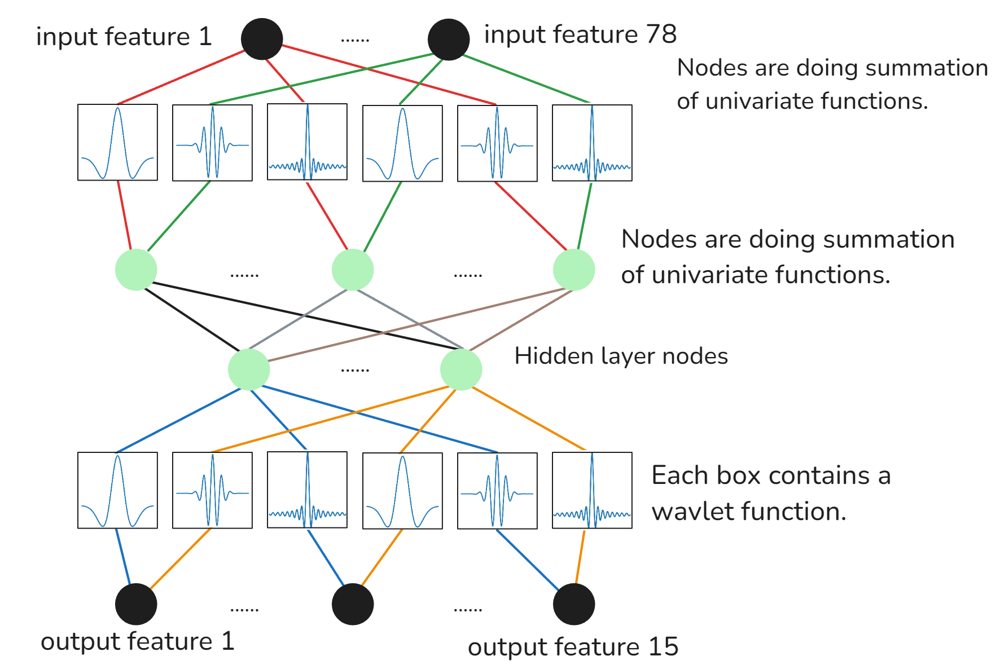

## Implemented Wavelets

The project implements various wavelet types for network traffic analysis:
- Mexican Hat (Ricker wavelet)
- Morlet wavelet
- Derivative of Gaussian (DoG)
- Meyer wavelet
- Shannon wavelet

## Features

- Binary classification of network traffic (normal vs. anomalous)
- Multi-class classification of different types of network attacks
- Implementation of various wavelet transformations
- Early stopping and model parameter tuning
- Performance evaluation metrics (accuracy, precision, recall, F1 score)
- Visualization of results and model performance

## Model Architecture

## How to Use

### Requirements

- Python 3.10
- PyTorch 2.6.0
- NumPy
- pandas
- matplotlib
- seaborn
- scikit-learn
- tqdm

### Binary Classification

1. Open `models/wavkan_bin.ipynb` in a Jupyter environment
2. Make sure the data files are in the correct location
3. Run the notebook cells sequentially to:
   - Load and prepare the data
   - Build the Wav-KAN model
   - Train the model with different wavelet types
   - Evaluate the model performance
   - Visualize the results

### Multi-class Classification

Similarly, use `models/wavkan_multi.ipynb` for multi-class network attack classification.

The Wav-KAN model consists of:
- Input layer matching the network traffic feature dimensions
- Hidden layers with wavelet transformations
- Batch normalization layers
- Output layer for classification

## Results

The model achieves high accuracy in traffic classification, with the binary classification task reaching F1 scores above 0.97 for certain wavelet types. The Shannon wavelet consistently performs well across evaluation metrics.

## References

- Bozorgasl, Zavareh and Chen, Hao, Wav-KAN: Wavelet Kolmogorov-Arnold Networks (May, 2024)
- https://arxiv.org/abs/2405.12832
- https://papers.ssrn.com/sol3/papers.cfm?abstract_id=4835325
- Efficient KAN notation: https://github.com/Blealtan/efficient-kan

## Acknowledgements

- This implementation is based on the Wav-KAN paper and utilizes efficient KAN notation and some parts of the code from: https://github.com/Blealtan/efficient-kan
- The data have been processed
